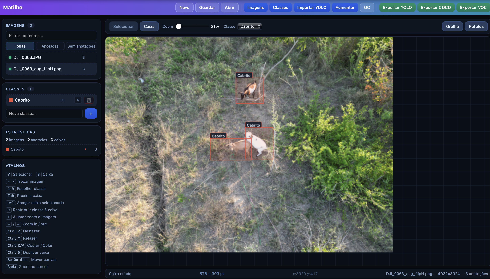

# Matilho

Ferramenta gratuita e de código aberto para anotação de imagens para *computer vision* — desenvolvida para quem precisa de preparar datasets de detecção de objectos sem depender de plataformas pagas, subscrições ou ligação à internet.

O problema que resolve é simples: treinar um modelo de detecção exige milhares de imagens anotadas, e as ferramentas existentes são ou pagas, ou complexas de instalar, ou requerem servidores na nuvem. O Matilho corre directamente no browser, sem instalar nada — basta abrir um ficheiro HTML com um servidor local.



---


## Para quem é útil

- **Investigadores e cientistas** que trabalham com dados visuais (biodiversidade, medicina, agricultura, geologia) e precisam de criar datasets para treinar modelos de IA sem infraestrutura técnica complexa.
- **Equipas académicas** que partilham datasets entre colaboradores sem budget para ferramentas comerciais.
- **Programadores e engenheiros de ML** que querem uma ferramenta local, rápida e sem fricção para iterar sobre datasets pequenos e médios.
- **Qualquer pessoa** que queira anotar imagens com bounding boxes e exportar no formato certo para o seu pipeline de treino.

---

## O que o software faz

Permite desenhar caixas delimitadoras (*bounding boxes*) sobre imagens, associar cada caixa a uma classe (por exemplo: "gazela", "elefante", "veículo"), e exportar as anotações nos formatos padrão da indústria — prontos a usar directamente em frameworks como YOLOv8, Detectron2 ou TensorFlow Object Detection.

Para além da anotação básica, o software inclui três funcionalidades que normalmente só existem em ferramentas avançadas:

**Augmentação de dados** — gera automaticamente variações das imagens anotadas (espelho horizontal e vertical, ajuste de brilho e contraste, desfoque, ruído gaussiano, crop aleatório) com as bounding boxes transformadas de forma correspondente. Aumenta o tamanho do dataset sem trabalho manual adicional e exporta as imagens geradas juntamente com as originais.

**Quality Check** — analisa a nitidez de cada imagem usando o algoritmo da Variância do Laplaciano, identifica automaticamente as imagens desfocadas e permite apagá-las em lote antes de treinar o modelo. Imagens de baixa qualidade degradam o desempenho dos modelos; esta funcionalidade poupa horas de revisão manual.

**Persistência total** — as imagens e anotações são guardadas automaticamente entre sessões usando o armazenamento local do browser (IndexedDB + localStorage). Fecha, reabre, o trabalho está lá.

---

## Formatos de exportação

| Formato | Descrição |
|---|---|
| **YOLO** | ZIP com `images/`, `labels/`, `classes.txt` e `data.yaml` prontos para YOLOv5/v8/v9 |
| **COCO JSON** | Formato MS COCO com `images`, `annotations` e `categories` |
| **Pascal VOC** | ZIP com ficheiros XML por imagem |

---

## Stack tecnológico

O Matilho foi construído intencionalmente sem frameworks, sem bundlers e sem dependências de runtime. A decisão de design é que qualquer pessoa com um browser moderno possa usar a ferramenta imediatamente.

**Linguagens**
- JavaScript ES6+ (módulos nativos `type="module"`)
- HTML5
- CSS3

**APIs do browser utilizadas**
- **Canvas API** — renderização da imagem e das bounding boxes, com requestAnimationFrame para performance
- **IndexedDB** — persistência dos ficheiros de imagem entre sessões
- **localStorage** — persistência das anotações e classes
- **File API + Blob URLs** — carregamento de imagens do disco sem upload para servidor
- **URL.createObjectURL / revokeObjectURL** — gestão eficiente de memória para ficheiros de imagem

**Algoritmos implementados**
- **Variância do Laplaciano** — detecção de blur por convolução com kernel 3×3 sobre pixels em escala de cinzento, com análise estatística da variância resultante
- **Transformações afins** — flip horizontal/vertical com recálculo de coordenadas das bounding boxes
- **Manipulação directa de pixels** — brilho, contraste e ruído gaussiano via `getImageData` / `putImageData`

**Bibliotecas externas (vendored)**
- [JSZip](https://stuk.github.io/jszip/) — geração de ficheiros ZIP no browser
- [FileSaver.js](https://github.com/eligrey/FileSaver.js/) — download de ficheiros cross-browser

**Arquitectura**
- Aplicação de página única (SPA) sem router
- 14 módulos ES6 com dependências explícitas e sem dependências circulares
- Estado central partilhado via referência ao mesmo objecto em todos os módulos
- Histórico de undo/redo implementado com snapshots imutáveis (até 60 estados)

---

## Instalação

Não requer instalação. Clona o repositório e serve os ficheiros com qualquer servidor HTTP local:

```bash
git clone https://github.com/mirosaide/matilho.git
cd matilho

# Python 3
python -m http.server 8080

ou

# Node.js
npx serve .
```

Abre `http://localhost:8080` no browser.

> **Nota:** É necessário um servidor HTTP (não funciona com `file://`) porque os módulos ES6 são bloqueados pelo browser em protocolo `file://` por razões de segurança (CORS).

**Requisitos do browser:** Chrome 90+, Firefox 90+, Edge 90+, Safari 15+.

---


## Licença

MIT License © 2026 Miro Saide
